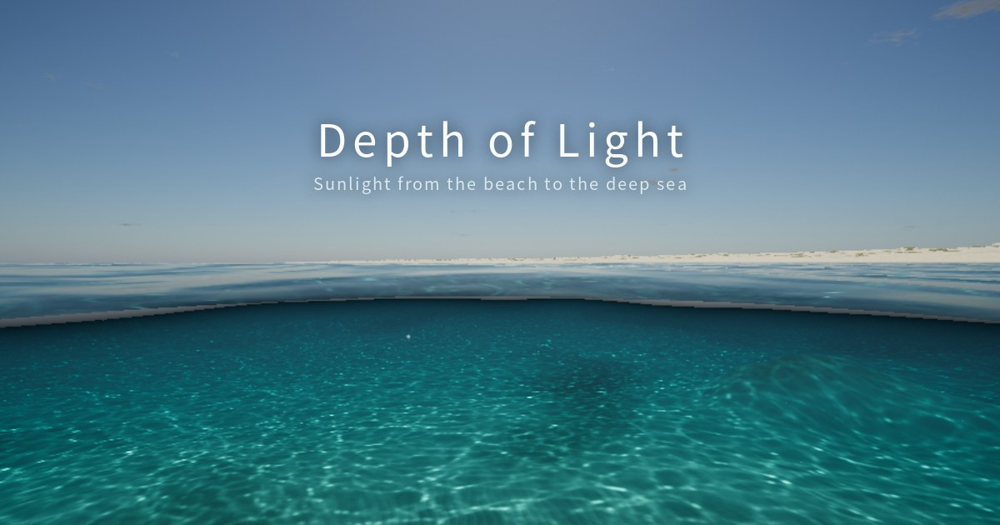

# Depth of Light

A real-time ocean in the browser that shows how sunlight changes with depth and angle — from the beach, through the surf, down to the deep sea.

**▶ Live:** https://lolkain.github.io/depth-of-light/

This repository hosts the published simulator: a single, self-contained `index.html`.

## What you can explore

- **Three coast types**: a tropical coral reef, a temperate coast and a Yellow Sea–style tidal flat. Each has its own seabed, waves and water.
- **Light by depth**: red fades first, then green, until only blue remains. Watch it happen as you dive.
- **Readout panel** with three tabs:
  - **Light**: how much red, green and blue light is left, and what white, yellow and red objects look like at your depth.
  - **Water**: what is dimming the light (the water itself, plankton, dissolved organics, sediment), plus water type, attenuation and visibility.
  - **Sun angle**: sun and refraction angles, surface transmittance and Snell's window.
- **Controls** for sun position, cloud cover, sea state, water clarity, dive lamp and render quality.

## Controls

| Input | Action |
| --- | --- |
| Drag | Look around |
| W A S D | Move |
| Q / E | Down / up |
| Shift | Move faster |
| Mouse wheel | Move forward |
| `[` `]` | Previous / next viewpoint |

Use the viewpoint strip at the bottom or click the seabed transect to jump to any spot.

## Requirements

A browser with WebGL 2 (current Chrome, Edge, Firefox or Safari). Rendering quality adapts to the device automatically; you can also pick it in Settings.

## How it works

- Sea surface: three FFT wave cascades, plus analytic swell that shoals into cnoidal waves and breaking bores near the shore.
- Water optics: an inherent-optical-properties model (Jerlov water types, phytoplankton, CDOM, sediment) drives absorption, scattering, caustics and light shafts.
- Terrain and surface are ray-marched in a full-screen shader, with baked height clipmaps to keep it light.
- Everything runs on the viewer's GPU; nothing is sent to a server.

## 한국어 소개

해변에서 심해까지, 수심과 입사각에 따라 햇빛이 어떻게 달라지는지 보여주는 웹 실시간 바다 시뮬레이터입니다. 열대 산호초, 온대 연안, 황해형 갯벌의 세 가지 해안을 오가며 빛의 감쇠, 수중 색 변화, 빛을 줄이는 요인을 확인할 수 있습니다. 화면 오른쪽 위 버튼으로 한국어·영어를 전환할 수 있습니다.

## License

[MIT](LICENSE) © 2026 lolkain

## Credits

Built with [three.js](https://threejs.org), © 2010-2026 three.js authors, used under the MIT License. Its copyright and permission notice is included in `index.html`.
